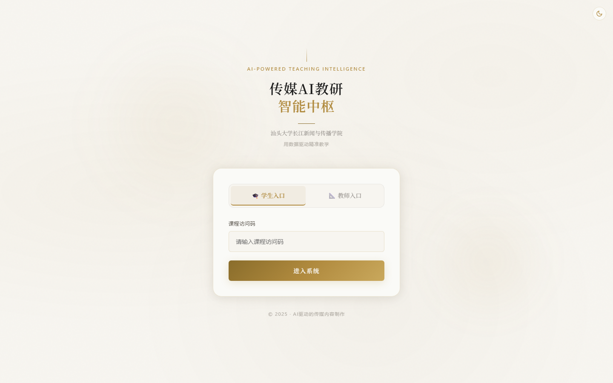
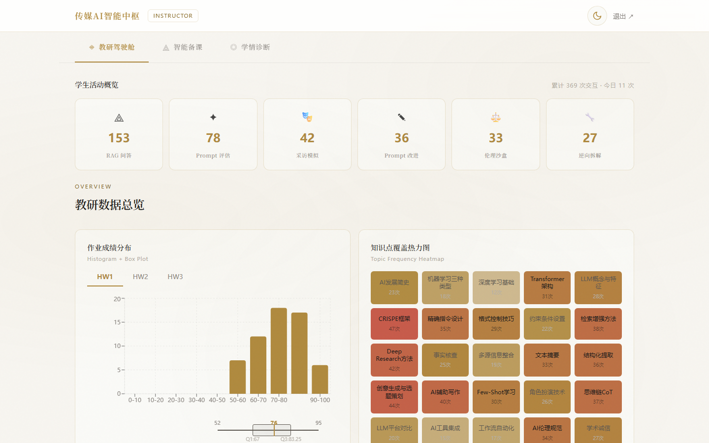
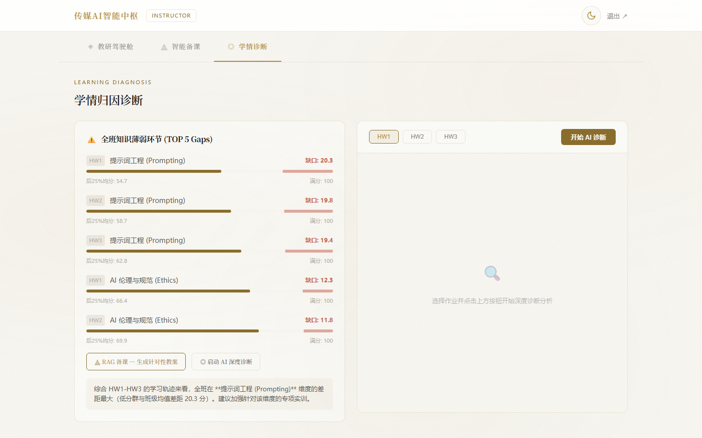
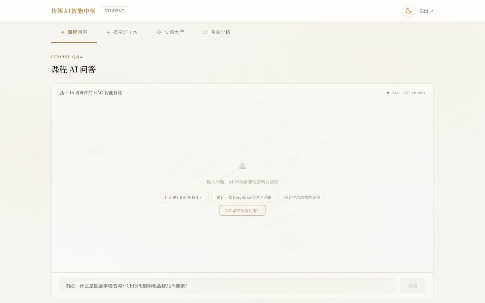
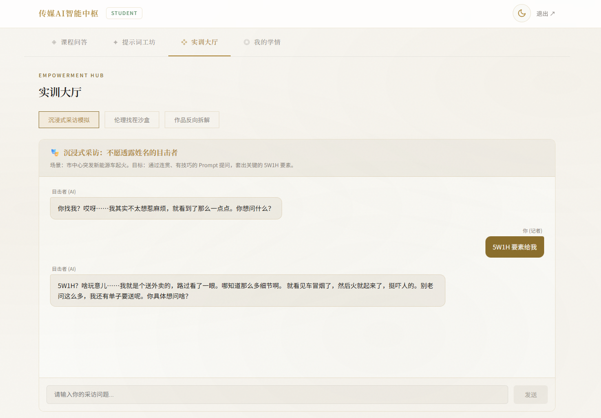
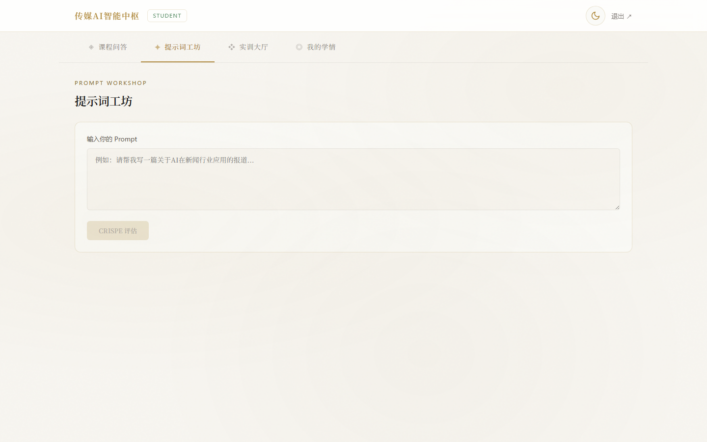

<div align="center">

# 🎓 AI Media Teaching Hub

### 传媒AI教研智能中枢

**Next.js 15** · **FastAPI** · **MiniMax** · **RAG** · **Docker**

一个开箱即用的传媒课程智能教研与学情分析平台模板，支持教师精准教学与学生 AI 辅助学习。

[](LICENSE)
[](https://github.com/icgma/ai-media-teaching-hub/pulls)
[](docker-compose.yml)
[](backend/requirements.txt)
[](frontend/package.json)

---

</div>

## ✨ 功能亮点

<table>
<tr>
<td width="50%">

### 📊 教师端 — 精准教学
- **学情诊断仪表盘** — 成绩分布雷达图、知识薄弱点热力图
- **RAG 课程问答** — 基于课程资料的 AI 教研助手
- **DeepSeek 大模型** — 教案生成、题目设计、教学建议
- **一键部署** — Docker Compose 三容器架构

</td>
<td width="50%">

### 🎓 学生端 — AI 辅学
- **AI 学习助手** — MiniMax 驱动的智能问答（5-key 轮询）
- **提示词教练** — CRISPE 框架评估与改进
- **RAG 课程问答** — 基于课程资料的智能检索与回答
- **伦理沙盒** — AI 伦理情境模拟与思辨训练

</td>
</tr>
</table>

## 🖼️ 系统截图

> 以下为系统主要页面展示

<table>
<tr>
<td align="center"><b>登录页</b></td>
<td align="center"><b>教师仪表盘</b></td>
</tr>
<tr>
<td>



</td>
<td>



</td>
</tr>
<tr>
<td align="center"><b>学情诊断</b></td>
<td align="center"><b>RAG 课程问答</b></td>
</tr>
<tr>
<td>



</td>
<td>



</td>
</tr>
<tr>
<td align="center"><b>学生 AI 对话</b></td>
<td align="center"><b>提示词教练</b></td>
</tr>
<tr>
<td>



</td>
<td>



</td>
</tr>
</table>


## 🏗️ 系统架构

```
┌─────────────────────────────────────────────────────────────┐
│                    Nginx (Reverse Proxy + SSL)               │
├────────────────────────────┬────────────────────────────────┤
│     Frontend (:3000)       │       Backend (:8000)           │
│     Next.js 15 App Router  │       FastAPI + Uvicorn         │
│                            │                                 │
│  ┌──────────────────────┐  │  ┌────────────────────────────┐ │
│  │ 📊 Teacher Dashboard │  │  │ 🔐 /api/auth     JWT 认证  │ │
│  │ 🎓 Student Portal    │  │  │ 💬 /api/chat     LLM 对话   │ │
│  │ 🎯 Prompt Coach      │  │  │ 📚 /api/rag      RAG 检索   │ │
│  │ 📈 Diagnosis         │  │  │ 📊 /api/insight  学情诊断   │ │
│  └──────────────────────┘  │  └────────────────────────────┘ │
├────────────────────────────┴────────────────────────────────┤
│                        Data Layer                            │
│   ChromaDB (向量存储)  │  CSV/JSON (成绩数据)  │  日志        │
├─────────────────────────────────────────────────────────────┤
│                      LLM Backends (OpenAI-Compatible)        │
│                                                              │
│  👨‍🏫 教师端: DeepSeek / 任意兼容 API    │  🎓 学生端: MiniMax (5-key 轮询) │
└─────────────────────────────────────────────────────────────┘
```

## 🚀 快速开始

### 一键启动 (Docker)

```bash
# 1️⃣ 克隆仓库
git clone https://github.com/icgma/ai-media-teaching-hub.git
cd ai-media-teaching-hub

# 2️⃣ 配置环境变量
cp backend/.env.example backend/.env
# 编辑 backend/.env，填入你的 API Key

# 3️⃣ 启动服务
docker compose up --build
```

启动后访问：
- 🖥️ **前端界面**: http://localhost:3000
- 📡 **后端 API 文档**: http://localhost:8000/docs

### 本地开发（不用 Docker）

```bash
# Backend
cd backend
python -m venv venv
source venv/bin/activate    # Linux/Mac
# venv\Scripts\activate     # Windows
pip install -r requirements.txt
cp .env.example .env        # 编辑填入 API Key
uvicorn app.main:app --reload --port 8000

# Frontend (新终端)
cd frontend
npm install
npm run dev
```

## 🔑 默认账号

| 角色 | 凭证 | 权限 |
|:----:|:----:|:----:|
| 🧑‍🏫 **教师** | 密码: `changeme` | 完整管理权限 |
| 🎓 **学生** | 访问码: `stu2025` | 学习与对话功能 |

> ⚠️ **生产部署前务必修改** `backend/.env` 中的密码和 `JWT_SECRET`

## ⚙️ 环境变量说明

```bash
# backend/.env.example

# ── LLM 配置 ──
TEACHER_API_KEY=sk-your-key          # 教师端 LLM (DeepSeek 等)
TEACHER_BASE_URL=https://api.deepseek.com/v1
TEACHER_MODEL=deepseek-chat

MINIMAX_API_KEY_1=sk-key1            # 学生端 MiniMax (5-key 轮询)
MINIMAX_API_KEY_2=sk-key2
MINIMAX_API_KEY_3=sk-key3
MINIMAX_API_KEY_4=sk-key4
MINIMAX_API_KEY_5=sk-key5

# ── 认证 ──
TEACHER_PASSWORD=changeme            # 改为强密码
STUDENT_ACCESS_CODE=stu2025
JWT_SECRET=change-this-to-random     # 改为随机字符串
```

## 🛠️ 技术栈

| 层级 | 技术 | 说明 |
|:----:|:----:|:----:|
| **前端** | Next.js 15, TypeScript, Tailwind CSS | App Router, SSR |
| **后端** | FastAPI, Python 3.11 | 异步 SSE 流式输出 |
| **LLM** | DeepSeek + MiniMax | OpenAI 兼容 SDK, 5-key 轮询 |
| **RAG** | LangChain + ChromaDB | 课程资料检索增强 |
| **部署** | Docker Compose, Nginx | 一键生产部署 |

## 📁 项目结构

```
ai-media-teaching-hub/
├── backend/                  # FastAPI 后端
│   ├── app/
│   │   ├── main.py           # 应用入口 & 生命周期
│   │   ├── config.py         # Pydantic 配置 (env)
│   │   ├── auth.py           # JWT 认证
│   │   ├── llm.py            # 双 LLM 服务层 (DeepSeek + MiniMax)
│   │   ├── rag.py            # ChromaDB 向量存储
│   │   ├── chat.py           # SSE 流式对话
│   │   ├── rag_router.py     # RAG 检索问答
│   │   ├── prompt_coach.py   # CRISPE 提示词教练
│   │   └── routers/          # 学情诊断、成绩分析等
│   ├── Dockerfile
│   └── requirements.txt
├── frontend/                 # Next.js 前端
│   ├── src/
│   │   ├── app/
│   │   │   ├── page.tsx      # 登录页
│   │   │   ├── teacher/      # 教师端仪表盘
│   │   │   └── student/      # 学生端门户
│   │   ├── components/       # UI 组件
│   │   └── lib/              # API 客户端、流式处理
│   └── Dockerfile
├── data/                     # 数据目录
│   ├── rag_corpus/           # RAG 语料 (Markdown)
│   └── grades/               # 成绩 CSV
├── nginx/                    # Nginx 反向代理配置
├── docker-compose.yml        # 开发环境
├── docker-compose.prod.yml   # 生产环境
├── deploy.sh                 # 一键部署脚本
└── docs/                     # 部署文档
```

## 📖 文档

- [VPS 一键部署指南](docs/VPS_%E9%83%A8%E7%BD%B2%E6%8C%87%E5%8D%97.md)
- [Production Deployment Guide](docs/DEPLOY.md)

## 🤝 贡献

欢迎 Fork & PR！

1. Fork 本仓库
2. 创建特性分支 (`git checkout -b feature/amazing-feature`)
3. 提交更改 (`git commit -m 'feat: add amazing feature'`)
4. 推送到分支 (`git push origin feature/amazing-feature`)
5. 提交 Pull Request

## 📄 License

[MIT](LICENSE) — 自由使用、修改和分发。

---

<div align="center">

**Made with ❤️ by [ICGMA STU CSS Team](https://github.com/icgma)**

</div>
